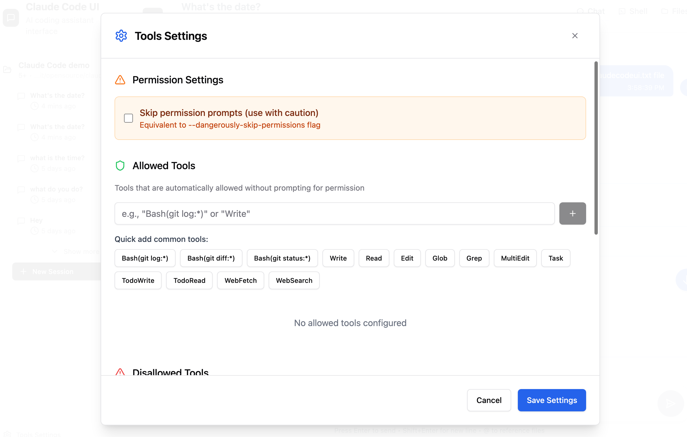

<div align="center">
  
  <h1>Claude Code UI — Summer Edition ☀️</h1>
  <p>A community fork of <a href="https://github.com/siteboon/claudecodeui">CloudCLI / Claude Code UI</a>, focused on enhancing the <b>Claude Code</b> experience.<br>Real-time streaming, thinking visualization, tool progress, cost tracking — bringing VS Code-level rendering to the web UI.</p>
</div>

<p align="center">
  <a href="https://github.com/siteboon/claudecodeui"></a>
  <a href="https://github.com/FuHesummer/claudecodeui-summer"></a>
</p>

> **Note**: This is a modified ("魔改") version. For the original project, visit [siteboon/claudecodeui](https://github.com/siteboon/claudecodeui).

<div align="right"><i><b>English</b> · <a href="./README.zh-CN.md">中文</a></i></div>

---

## What's Different in Summer Edition

This fork focuses exclusively on improving the **Claude Code** integration. The upstream project supports Claude Code, Cursor CLI, Codex, and Gemini CLI — we keep that multi-provider support intact but invest our effort into making the Claude Code experience best-in-class.

### Key Enhancements

| Feature | Description |
|---|---|
| **Real-time Stream Rendering** | SDK messages (`stream_event`, `assistant`, `tool_progress`, etc.) are parsed and rendered as they arrive, not buffered |
| **Thinking Block Visualization** | `<Thinking>` blocks stream in real time with duration tracking (`thinkingDurationMs`) |
| **Tool Progress Display** | Live progress bars and status text for running tools |
| **Subagent Containers** | Nested agent tasks rendered with task ID matching and progress logs |
| **Rate Limit Banner** | Countdown banner when API rate limits are hit |
| **Cost Info Bar** | Per-response cost, duration, and model display in the input area |
| **Agent Status Feed** | SDK status messages (`Reading file...`, `Searching codebase...`) displayed in real-time via ClaudeStatus |
| **Reduced Stream Latency** | Flush interval reduced from 100ms to 33ms for smoother streaming |
| **Security Hardening** | gray-matter frontmatter engine disabled for JS/JSON to prevent code execution |

### Architecture Changes

- **Backend**: SDK messages classified with `classifySDKMessage()` → `subType` tag before forwarding via WebSocket
- **Frontend**: Monolithic `useChatRealtimeHandlers` refactored into routing entry + 9 modular handler files
- **Types**: Extended `ChatMessage` with `isThinking`, `thinkingDurationMs`, `toolName`, `toolInput`, `progressPercentage`, `subagentId`, etc.
- **i18n**: All new UI strings added to 5 languages (en, zh-CN, ko, ja, ru)

---

## Screenshots

<div align="center">
  
<table>
<tr>
<td align="center">
<h3>Desktop View</h3>

<br>
<em>Main interface showing project overview and chat</em>
</td>
<td align="center">
<h3>Mobile Experience</h3>

<br>
<em>Responsive mobile design with touch navigation</em>
</td>
</tr>
<tr>
<td align="center" colspan="2">
<h3>CLI Selection</h3>

<br>
<em>Select between Claude Code, Gemini, Cursor CLI and Codex</em>
</td>
</tr>
</table>


</div>

## Features

All upstream features are preserved:

- **Responsive Design** - Works seamlessly across desktop, tablet, and mobile so you can also use Agents from mobile
- **Interactive Chat Interface** - Built-in chat interface for seamless communication with the Agents
- **Integrated Shell Terminal** - Direct access to the Agents CLI through built-in shell functionality
- **File Explorer** - Interactive file tree with syntax highlighting and live editing
- **Git Explorer** - View, stage and commit your changes. You can also switch branches
- **Session Management** - Resume conversations, manage multiple sessions, and track history
- **Plugin System** - Extend CloudCLI with custom plugins — add new tabs, backend services, and integrations. [Build your own →](https://github.com/cloudcli-ai/cloudcli-plugin-starter)
- **TaskMaster AI Integration** *(Optional)* - Advanced project management with AI-powered task planning, PRD parsing, and workflow automation
- **Model Compatibility** - Works with Claude, GPT, and Gemini model families (see [`shared/modelConstants.js`](shared/modelConstants.js) for the full list of supported models)

**Summer Edition adds:**

- **🔥 Real-time Message Streaming** - SDK messages rendered as they arrive (33ms flush interval)
- **💭 Thinking Block Streaming** - Watch Claude think in real time, with duration tracking
- **🔧 Tool Progress Display** - Live progress bars for running tools
- **🤖 Subagent Containers** - Nested agent tasks with progress logs
- **⏱️ Cost & Duration Tracking** - Per-response cost, model, and timing info
- **🚦 Rate Limit Handling** - Visual countdown banner when limits are hit
- **📡 Agent Status Feed** - Real-time status text from the SDK (Reading, Searching, etc.)


## Quick Start

### Development (from this fork)

```bash
git clone https://github.com/FuHesummer/claudecodeui-summer.git
cd claudecodeui-summer
npm install
cp .env.example .env
npm run dev
```

Open `http://localhost:3001` — all your existing Claude Code sessions are discovered automatically.

### Syncing with Upstream

```bash
git remote add upstream https://github.com/siteboon/claudecodeui.git
git fetch upstream
# Cherry-pick specific commits (merge will conflict due to unrelated histories)
git cherry-pick <commit-hash>
```

### PM2 Background Service (Production)

```bash
npm install -g pm2
pm2 start ecosystem.config.cjs
pm2 startup && pm2 save  # auto-start on boot
```

> This fork includes `ecosystem.config.cjs` with `WORKSPACES_ROOT` environment variable pre-configured.


---

## Upstream Compatibility

This fork is based on **CloudCLI / Claude Code UI v1.25.0** (commit `621853c`). We track upstream via cherry-pick (not merge, due to unrelated git histories). Security patches and critical fixes are regularly pulled in.

| Upstream Version | Status |
|---|---|
| v1.25.0 | ✅ Base fork |
| v1.25.2 | ✅ Security fix cherry-picked (`gray-matter` engine disable) |

## Which option is right for you?

CloudCLI UI is the open source UI layer that powers CloudCLI Cloud. You can self-host it on your own machine, or use CloudCLI Cloud which builds on top of it with a full managed cloud environment, team features, and deeper integrations.

| | CloudCLI UI (Self-hosted) | CloudCLI Cloud |
|---|---|---|
| **Best for** | Developers who want a full UI for local agent sessions on their own machine | Teams and developers who want agents running in the cloud, accessible from anywhere |
| **How you access it** | Browser via `[yourip]:port` | Browser, any IDE, REST API, n8n |
| **Setup** | `npx @siteboon/claude-code-ui` | No setup required |
| **Machine needs to stay on** | Yes | No |
| **Mobile access** | Any browser on your network | Any device, native app coming |
| **Sessions available** | All sessions auto-discovered from `~/.claude` | All sessions within your cloud environment |
| **Agents supported** | Claude Code, Cursor CLI, Codex, Gemini CLI | Claude Code, Cursor CLI, Codex, Gemini CLI |
| **File explorer and Git** | Yes, built into the UI | Yes, built into the UI |
| **MCP configuration** | Managed via UI, synced with your local `~/.claude` config | Managed via UI |
| **IDE access** | Your local IDE | Any IDE connected to your cloud environment |
| **REST API** | Yes | Yes |
| **n8n node** | No | Yes |
| **Team sharing** | No | Yes |
| **Platform cost** | Free, open source | Starts at $7/month |

> Both options use your own AI subscriptions (Claude, Cursor, etc.) — CloudCLI provides the environment, not the AI.

---

## Security & Tools Configuration

**🔒 Important Notice**: All Claude Code tools are **disabled by default**. This prevents potentially harmful operations from running automatically.

### Enabling Tools

To use Claude Code's full functionality, you'll need to manually enable tools:

1. **Open Tools Settings** - Click the gear icon in the sidebar
2. **Enable Selectively** - Turn on only the tools you need
3. **Apply Settings** - Your preferences are saved locally

<div align="center">


*Tools Settings interface - enable only what you need*

</div>

**Recommended approach**: Start with basic tools enabled and add more as needed. You can always adjust these settings later.

---

## Plugins

CloudCLI has a plugin system that lets you add custom tabs with their own frontend UI and optional Node.js backend. Install plugins from git repos directly in **Settings > Plugins**, or build your own.

### Available Plugins

| Plugin | Description |
|---|---|
| **[Project Stats](https://github.com/cloudcli-ai/cloudcli-plugin-starter)** | Shows file counts, lines of code, file-type breakdown, largest files, and recently modified files for your current project |

### Build Your Own

**[Plugin Starter Template →](https://github.com/cloudcli-ai/cloudcli-plugin-starter)** — fork this repo to create your own plugin. It includes a working example with frontend rendering, live context updates, and RPC communication to a backend server.

**[Plugin Documentation →](https://cloudcli.ai/docs/plugin-overview)** — full guide to the plugin API, manifest format, security model, and more.

---
## FAQ

<details>
<summary>How is this different from Claude Code Remote Control?</summary>

Claude Code Remote Control lets you send messages to a session already running in your local terminal. Your machine has to stay on, your terminal has to stay open, and sessions time out after roughly 10 minutes without a network connection.

CloudCLI UI and CloudCLI Cloud extend Claude Code rather than sit alongside it — your MCP servers, permissions, settings, and sessions are the exact same ones Claude Code uses natively. Nothing is duplicated or managed separately.

Here's what that means in practice:

- **All your sessions, not just one** — CloudCLI UI auto-discovers every session from your `~/.claude` folder. Remote Control only exposes the single active session to make it available in the Claude mobile app.
- **Your settings are your settings** — MCP servers, tool permissions, and project config you change in CloudCLI UI are written directly to your Claude Code config and take effect immediately, and vice versa.
- **Works with more agents** — Claude Code, Cursor CLI, Codex, and Gemini CLI, not just Claude Code.
- **Full UI, not just a chat window** — file explorer, Git integration, MCP management, and a shell terminal are all built in.
- **CloudCLI Cloud runs in the cloud** — close your laptop, the agent keeps running. No terminal to babysit, no machine to keep awake.

</details>

<details>
<summary>Do I need to pay for an AI subscription separately?</summary>

Yes. CloudCLI provides the environment, not the AI. You bring your own Claude, Cursor, Codex, or Gemini subscription. CloudCLI Cloud starts at $7/month for the hosted environment on top of that.

</details>

<details>
<summary>Can I use CloudCLI UI on my phone?</summary>

Yes. For self-hosted, run the server on your machine and open `[yourip]:port` in any browser on your network. For CloudCLI Cloud, open it from any device — no VPN, no port forwarding, no setup. A native app is also in the works.

</details>

<details>
<summary>Will changes I make in the UI affect my local Claude Code setup?</summary>

Yes, for self-hosted. CloudCLI UI reads from and writes to the same `~/.claude` config that Claude Code uses natively. MCP servers you add via the UI show up in Claude Code immediately and vice versa.

</details>

---

## Community & Support

- **Upstream Project**: [siteboon/claudecodeui](https://github.com/siteboon/claudecodeui) — the original project
- **This Fork**: [FuHesummer/claudecodeui-summer](https://github.com/FuHesummer/claudecodeui-summer) — Summer Edition
- **Upstream Documentation**: [cloudcli.ai/docs](https://cloudcli.ai/docs) — installation, configuration, features
- **Upstream Discord**: [discord.gg/buxwujPNRE](https://discord.gg/buxwujPNRE) — upstream community

## License

GNU General Public License v3.0 - see [LICENSE](LICENSE) file for details.

This project is open source and free to use, modify, and distribute under the GPL v3 license.

## Acknowledgments

### Upstream
- **[CloudCLI / Claude Code UI](https://github.com/siteboon/claudecodeui)** - The original project by Siteboon that this fork is based on

### Built With
- **[Claude Code](https://docs.anthropic.com/en/docs/claude-code)** - Anthropic's official CLI
- **[Cursor CLI](https://docs.cursor.com/en/cli/overview)** - Cursor's official CLI
- **[Codex](https://developers.openai.com/codex)** - OpenAI Codex
- **[Gemini-CLI](https://geminicli.com/)** - Google Gemini CLI
- **[React](https://react.dev/)** - User interface library
- **[Vite](https://vitejs.dev/)** - Fast build tool and dev server
- **[Tailwind CSS](https://tailwindcss.com/)** - Utility-first CSS framework
- **[CodeMirror](https://codemirror.net/)** - Advanced code editor
- **[TaskMaster AI](https://github.com/eyaltoledano/claude-task-master)** *(Optional)* - AI-powered project management and task planning


### Sponsors
- [Siteboon - AI powered website builder](https://siteboon.ai)
---

<div align="center">
  <strong>Summer Edition ☀️ — Making Claude Code UI better, one stream at a time.</strong>
  <br><br>
  <sub>Based on <a href="https://github.com/siteboon/claudecodeui">CloudCLI</a> by <a href="https://siteboon.ai">Siteboon</a></sub>
</div>
